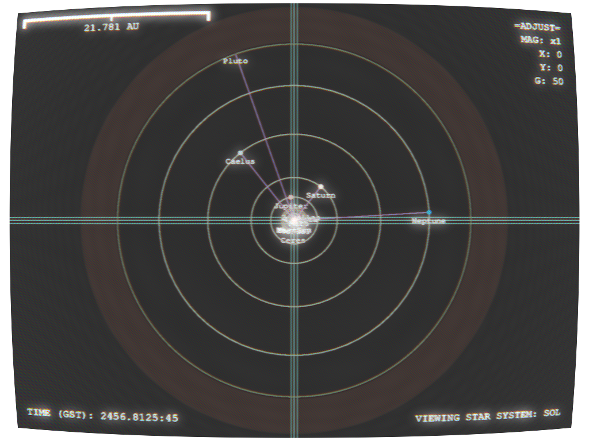
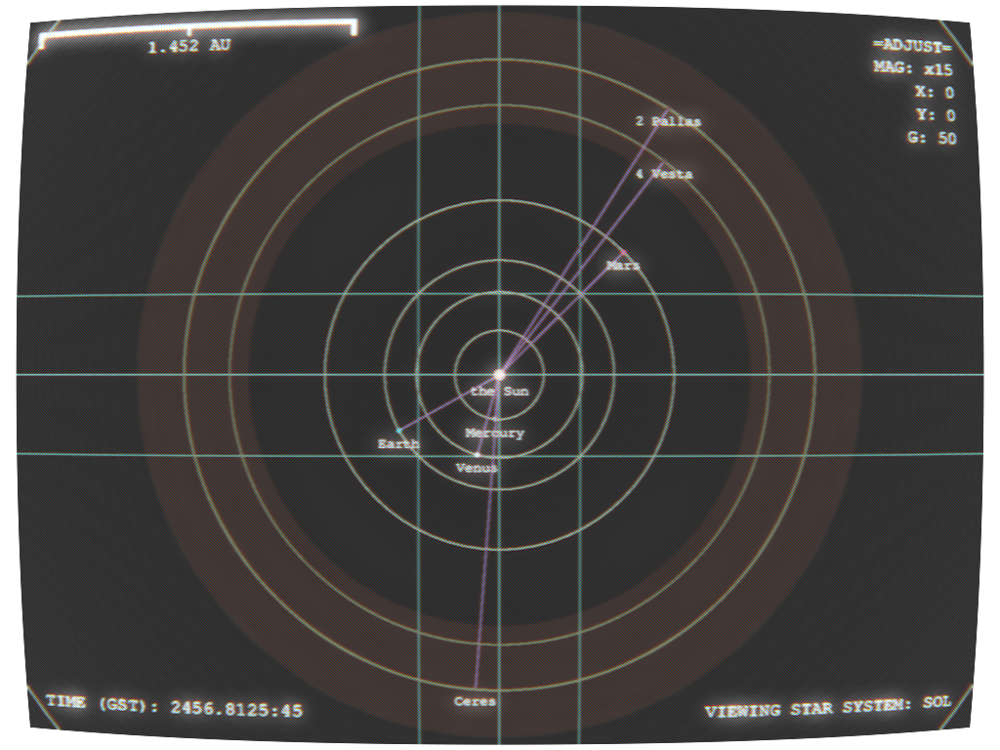
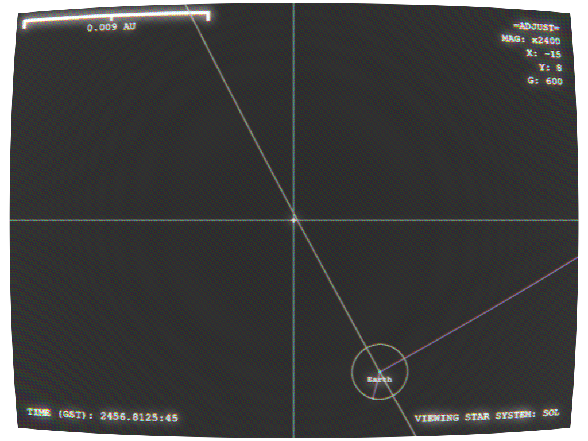
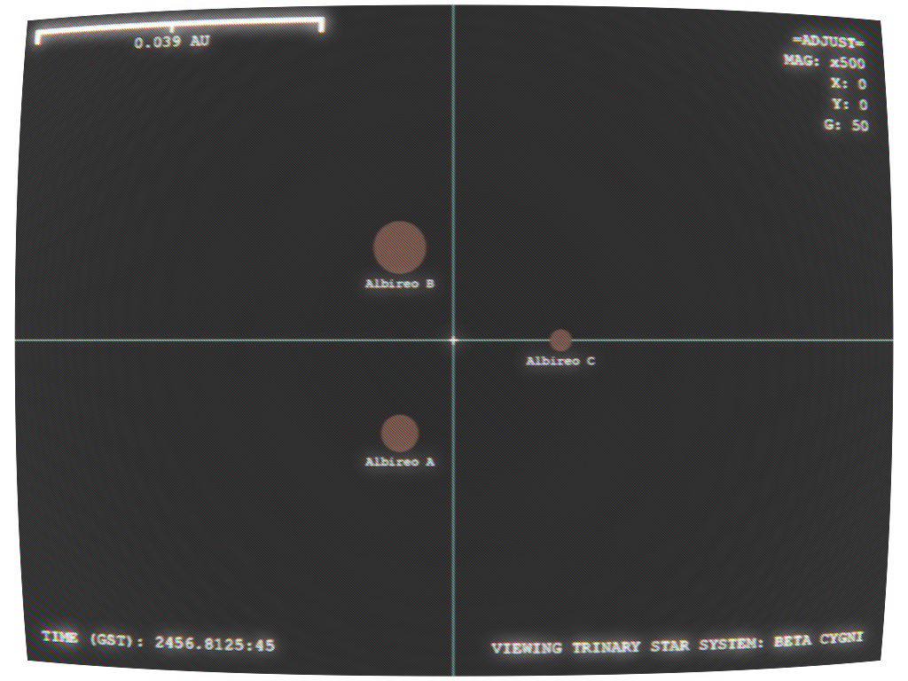

# StarBox
An engine for obsessive compulsives with an inability not to overthink such as myself to simulate a living universe for a science fiction TTRPG

**Very much in-development**

# Goals:
- [ ] A structured multi-level "board" around which "game pieces" can be moved
- [ ] An interface for the addition and seamless integration of new locations and pieces into the board
- [x] A timekeeping function to increment and decrement time in the game world, and move orbiting pieces as appropriate
- [ ] Potentially: A web application allowing players to explore locations they have seen

# Program Structure:

## Bottom layer, section A: The Game Board
A mostly-static set of objects in memory, interconnected and tiered by way of attributes referencing each other
These objects integrate portions of AstroPy for their attributes, allowing for easy unit conversion and geometric operations

## Lower interface sublayer
A set of functions to manipulate elements of the game board such as creation of celestial bodies, as well as changing their positions to correspond with the passage of game time

## Minor / Future:

### WebApp:
A CLI tool to navigate the game board and render simplistic star system maps

# Graphics:
StarBox uses TKInter to render rudimentary graphical representations of locations in space, which are then passed through the GIMP CLI with a filter method of my own design (with a few numbers from the internet) to simulate a composite video signal feeding to a CRT display. The resulting image can be edited into photos, displayed on prop CRTs, or simply posted in a chat room as a way to set an aesthetic.

The possible eventual StarBox web application will display this image on a simulated screen next to the command line.

